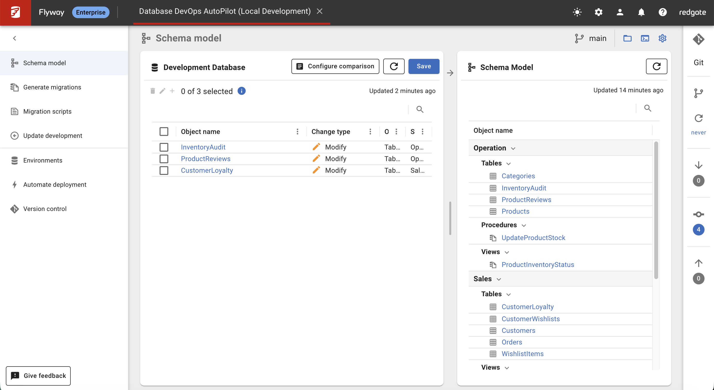

## Overview

Now that you have your amazing e-commerce platform deployed with customers, products, loyalty program, and product reviews, it's time to learn how Flyway AutoPilot captures and manages schema changes. In this lab, you'll make changes to your database and see how AutoPilot tracks and manages those changes.

## Learning Objectives

- Understand how Flyway Desktop captures schema changes
- Make changes to your e-commerce platform database
- Save changes to the schema model
- Commit schema changes to version control
- Experience the AutoPilot workflow for database evolution

## Prerequisites

- Completed Lab 3 (your e-commerce platform is deployed and running)
- Flyway Desktop connected to your development database
- Understanding of the 4-environment architecture (Development, Shadow, UAT, Production)
- Access to your SQL tool (SSMS/VS Code) for making changes

## Understanding Your 4-Environment Architecture

Before we start capturing schema changes, let's review the **4-environment setup** you configured in Lab 3:

### **Environment Roles:**

1. **Development** (`db-autopilot-dev-001`): Active development and feature testing
2. **Shadow** (`db-autopilot-shadow-001`): Clean validation database for migration testing
3. **UAT** (`db-autopilot-uat-001`): User acceptance testing environment
4. **Production** (`db-autopilot-prod-001`): Live production environment

### **Shadow Database Purpose:**

The **Shadow Database** is key to AutoPilot's change detection:

- **Clean Slate**: Rebuilt frequently to ensure pristine migration state
- **Change Validation**: Compares against development to detect uncommitted changes
- **Migration Testing**: Validates that migration scripts work correctly
- **Drift Detection**: Ensures development changes are properly captured

In this lab, you'll make changes to development and see how AutoPilot uses the shadow database to detect and validate those changes.

## Step 1: Prepare for Schema Change Capture

### 1. Important: Clean Your Schema Model First

Before starting this lab, we need to ensure your schema model accurately reflects only what's currently in your database. If you have any schema model files from previous experimentation, they might cause AutoPilot to show unexpected DROP operations instead of the CREATE operations we want to demonstrate.

**Clean up any existing wishlist artifacts:**

1. **Navigate to your project folder** in File Explorer/Finder
2. **Go to the `schema-model/` folder**
3. **Look for any wishlist-related files** in:
   - `schema-model/Tables/Sales/` (CustomerWishlists.sql, WishlistItems.sql)
   - `schema-model/Views/Sales/` (CustomerWishlistAnalytics.sql)
4. **Delete any wishlist files** if they exist from previous work
5. **This ensures a clean starting point** for the lab

### 2. Connect to Your E-Commerce Platform

1. **Open Flyway Desktop** and ensure your project is loaded
2. **Switch to the Schema Model tab**
3. **Click Refresh** to scan your `db-autopilot-dev-001` database

Since you completed all migrations in Lab 3, Flyway Desktop should show **'No changes found'** - this indicates your database schema is synchronized with your schema model.

**Expected View:**

- All your tables (Customers, Products, Orders, CustomerLoyalty, ProductReviews) are in the schema model
- Views (CustomerOrdersSummary, ProductInventoryStatus, ProductRatingSummary) are captured
- Stored procedures (AddCustomerFeedback, UpdateProductStock) are tracked

### 2. Explore Your Current E-Commerce Schema

Take a moment to explore what AutoPilot has captured:

**📊 In the Schema Model panel, you should see:**

- **Sales schema**: Customers, Orders, CustomerLoyalty tables
- **Operation schema**: Products, Categories, ProductReviews, InventoryAudit tables
- **Views**: Multiple business intelligence views
- **Stored Procedures**: Customer feedback and inventory management

**Important Note**: If you see any wishlist-related tables (CustomerWishlists, WishlistItems) in your schema model but NOT in your database, this creates a schema drift scenario where AutoPilot will want to DROP those tables. For this lab, we want to start clean and CREATE new tables, so make sure you've removed any wishlist artifacts from the schema-model/ folder as instructed in Step 1.



**⚠️ Don't Panic About "Modified" Status**: You might also see some legitimate tables like CustomerLoyalty, ProductReviews, or InventoryAudit showing as "modified" in Flyway Desktop. This is normal! These are important tables from your e-commerce platform that should NOT be deleted. The "modified" status usually indicates minor schema formatting differences. Simply check all these legitimate changes and click "Save" to sync them - do NOT delete these files from your schema-model folder.

This is your schema model - the single source of truth for your database structure!

## Step 2: Make Changes to Your E-Commerce Platform

Now let's enhance our e-commerce platform by adding new functionality. We'll add a customer wishlist feature and observe how AutoPilot captures these changes.

### 1. Connect to Your Development Database

**Using VS Code:**

1. Open Command Palette (Ctrl+Shift+P)
2. Type "MS SQL: Connect" and select your `db-autopilot-dev-001` connection

**Using SSMS:**

1. Connect to your Azure SQL Database server
2. Select the `db-autopilot-dev-001` database

### 2. Add a Product Wishlist Feature

**⚠️ IMPORTANT: Ensure you're connected to the correct database!**

Before running any SQL scripts, verify you're connected to your **development database**:

**Using VS Code:**

- Check the bottom status bar shows: `sqlbits.database.windows.net (db-autopilot-dev-001)`
- If not, use Command Palette → "MS SQL: Connect" and select `db-autopilot-dev-001`

**Using SSMS:**

- Check the Object Explorer shows you're connected to `db-autopilot-dev-001`
- If not, right-click server → "New Query" → select `db-autopilot-dev-001` from dropdown

Let's add tables to support a customer wishlist system. Execute this SQL in your **development** database:

```sql
-- Create Customer Wishlist table for our e-commerce platform
CREATE TABLE [Sales].[CustomerWishlists]
(
    [WishlistID] [int] IDENTITY(1,1) NOT NULL,
    [CustomerID] [nchar](5) NOT NULL,
    [WishlistName] [nvarchar](100) NOT NULL DEFAULT ('My Wishlist'),
    [CreatedDate] [datetime] NOT NULL DEFAULT (GETDATE()),
    [IsActive] [bit] NOT NULL DEFAULT (1),
    CONSTRAINT [PK_CustomerWishlists] PRIMARY KEY CLUSTERED ([WishlistID]),
    CONSTRAINT [FK_CustomerWishlists_Customers] FOREIGN KEY ([CustomerID]) REFERENCES [Sales].[Customers] ([CustomerID])
)
GO

-- Create Wishlist Items table
CREATE TABLE [Sales].[WishlistItems]
(
    [WishlistItemID] [int] IDENTITY(1,1) NOT NULL,
    [WishlistID] [int] NOT NULL,
    [ProductID] [int] NOT NULL,
    [AddedDate] [datetime] NOT NULL DEFAULT (GETDATE()),
    [Priority] [int] NOT NULL DEFAULT (3), -- 1=High, 2=Medium, 3=Low
    [Notes] [nvarchar](500) NULL,
    CONSTRAINT [PK_WishlistItems] PRIMARY KEY CLUSTERED ([WishlistItemID]),
    CONSTRAINT [FK_WishlistItems_Wishlists] FOREIGN KEY ([WishlistID]) REFERENCES [Sales].[CustomerWishlists] ([WishlistID]),
    CONSTRAINT [FK_WishlistItems_Products] FOREIGN KEY ([ProductID]) REFERENCES [Operation].[Products] ([ProductID]),
    CONSTRAINT [CK_WishlistItems_Priority] CHECK ([Priority] BETWEEN 1 AND 3)
)
GO

-- Create a view for wishlist analytics
CREATE VIEW [Sales].[CustomerWishlistAnalytics]
AS
SELECT
    cw.WishlistID,
    cw.CustomerID,
    c.CompanyName,
    cw.WishlistName,
    COUNT(wi.WishlistItemID) as ItemCount,
    AVG(CAST(p.UnitPrice AS FLOAT)) as AvgWishlistValue,
    SUM(p.UnitPrice) as TotalWishlistValue,
    MAX(wi.AddedDate) as LastAddedDate,
    cw.CreatedDate
FROM [Sales].[CustomerWishlists] cw
INNER JOIN [Sales].[Customers] c ON cw.CustomerID = c.CustomerID
LEFT JOIN [Sales].[WishlistItems] wi ON cw.WishlistID = wi.WishlistID
LEFT JOIN [Operation].[Products] p ON wi.ProductID = p.ProductID
WHERE cw.IsActive = 1
GROUP BY cw.WishlistID, cw.CustomerID, c.CompanyName, cw.WishlistName, cw.CreatedDate
GO

-- Add some sample wishlists
INSERT INTO [Sales].[CustomerWishlists] (CustomerID, WishlistName)
VALUES
    ('ALFKI', 'Tech Gadgets Wishlist'),
    ('ANATR', 'Gaming Setup Goals'),
    ('ANTON', 'Mobile Devices')
GO

-- Add some items to the wishlists
INSERT INTO [Sales].[WishlistItems] (WishlistID, ProductID, Priority, Notes)
VALUES
    (1, 1, 1, 'Want this for work productivity'),  -- ALFKI wants iPhone 15 Pro
    (1, 3, 2, 'Good for presentations'),          -- ALFKI wants MacBook Air
    (2, 4, 1, 'Must have for gaming!'),           -- ANATR wants PlayStation 5
    (2, 6, 2, 'Portable gaming option'),          -- ANATR wants Nintendo Switch
    (3, 2, 1, 'Upgrade from current phone')       -- ANTON wants Samsung Galaxy
GO

PRINT N'Product Wishlist feature added successfully'
PRINT N'Created CustomerWishlists and WishlistItems tables'
PRINT N'Added CustomerWishlistAnalytics view'
PRINT N'Added sample wishlist data'
```

**You have successfully added a product wishlist system to your e-commerce platform.**

## Step 3: Capture Changes in Flyway Desktop

### 1. Refresh and Review Changes

1. **Return to Flyway Desktop**
2. **Click Refresh** in the Schema Model tab
3. **Review the detected changes**


Flyway Desktop will now display the changes you made:

- **New tables detected**: CustomerWishlists, WishlistItems
- **New view detected**: CustomerWishlistAnalytics
- **New data detected**: Sample wishlist entries

You should see output similar to:

```
Changes detected:
Tables to CREATE: 2
Views to CREATE: 1
Data changes detected: 8 inserts
```

**This demonstrates AutoPilot's automated change detection capabilities.**

**💡 Teaching Note**: If you see DROP operations instead of CREATE operations, it means there were leftover wishlist files in your schema-model/ folder from previous work. This is actually a great real-world example of schema drift detection - AutoPilot noticed that your schema model contained objects that weren't in your database! For this lab, we want the CREATE experience, so make sure you've cleaned the schema-model/ folder as instructed in Step 1.

**⚠️ Important**: If you see legitimate tables like CustomerLoyalty, ProductReviews, or InventoryAudit showing as "modified" alongside your new wishlist tables, don't delete those schema model files! These are core e-commerce platform tables that belong in your schema. The "modified" status is just AutoPilot detecting minor formatting differences. Check all these legitimate changes and click "Save" to sync them up.

### 2. Review the Detected Changes

Before saving, take a moment to review what AutoPilot detected:

1. **Click on each detected change** to see the DDL script that Flyway generated
2. **Verify the table structures** look correct
3. **Check the view definition** matches what you created
4. **Review any constraints and foreign keys**

Notice how AutoPilot:

- **Captured exact table definitions** with all constraints
- **Detected foreign key relationships** to existing tables
- **Generated clean DDL scripts** ready for deployment
- **Identified data changes** in your tables

## Step 4: Save Changes to Schema Model

### 1. Select and Save Your Wishlist Feature Changes

1. **Check the boxes** next to all the changes you want to save:
   - Sales.CustomerWishlists table
   - Sales.WishlistItems table
   - Sales.CustomerWishlistAnalytics view
2. **Click "Save to Project"**
3. **Review the save confirmation** - Flyway will show what's being added to your schema model


**You have successfully saved your wishlist feature to the schema model.** These changes are now part of your project's single source of truth.

### 2. What Just Happened?

When you saved to the schema model, Flyway AutoPilot:

- **Created DDL scripts** for your new tables and views
- **Added them to the schema-model/** folder in your project
- **Updated the project metadata** to track these objects
- **Prepared everything for version control**

Your schema model now represents the current state of your enhanced e-commerce platform!

## Step 4.5: Shadow Database Validation (Optional but Recommended)

Before committing your changes, let's see how the **Shadow Database** validates your changes using AutoPilot's migration generation process:

### 1. Navigate to Generate Migrations

1. **In Flyway Desktop**, click on the **"Generate migrations"** tab in the left navigation
2. **Click the "Refresh" button** in the Generate migrations panel
3. **Wait for AutoPilot to analyze** your schema changes

You should see a success message similar to:

```
✅ Shadow database did not need to be reprovisioned.
✅ Successfully migrated shadow database to version 004. 4 migrations executed.
```


### 2. Review the Change Detection Results

In the changes list, you should now see your wishlist changes detected:

**Expected Changes:**

- **CustomerWishlists** - ➕ Create (Table, Sales schema)
- **WishlistItems** - ➕ Create (Table, Sales schema)
- **CustomerWishlistAnalytics** - ➕ Create (View, Sales schema)

### 3. What This Demonstrates

This shadow database validation shows:

- **AutoPilot automatically updated** the shadow database to match your current migrations (V001-V004)
- **Your new wishlist changes are detected** as CREATE operations (green ➕)
- **Existing tables show as MODIFY** (orange 🔧) due to minor schema sync differences
- **Shadow database is now ready** to compare against development changes

This validation ensures that:

- ✅ Shadow database has a clean baseline (all existing migrations applied)
- ✅ Your new changes are properly isolated and detected
- ✅ AutoPilot can accurately generate migration scripts
- ✅ The comparison between development and shadow is accurate

### 🎯 **Key Teaching Point - Why This Works So Well:**

```
Development Database:           Shadow Database:
├── V001 Baseline              ├── V001 Baseline
├── V002 Welcome               ├── V002 Welcome
├── V003 Customer Loyalty      ├── V003 Customer Loyalty
├── V004 Product Reviews       ├── V004 Product Reviews
├── CustomerWishlists (NEW!)   └── (stops here - clean!)
├── WishlistItems (NEW!)
└── CustomerWishlistAnalytics (NEW!)
```

**This Proves the Core AutoPilot Concept:**

- **Shadow = Clean baseline** (only committed migrations V001-V004)
- **Development = Active work** (migrations + your new manual changes)
- **AutoPilot = Smart comparison** (detects the gap and generates V005 migration)

**Why your CustomerWishlistAnalytics view isn't in shadow:** Because you created it manually in development! The shadow database only contains committed migrations, so AutoPilot can perfectly detect what's new and needs to become the next versioned migration script.

**This sets the stage perfectly for Lab 5 where you'll generate migration scripts from these detected changes.**

## Step 5: Commit Changes to Version Control

### 1. Review Uncommitted Changes

1. **In Flyway Desktop**, look for the **Version Control** panel (usually on the right side)
2. **Click on "Uncommitted Changes"**
3. **Review the files** that AutoPilot created:

You should see files similar to:

```
schema-model/Tables/Sales/CustomerWishlists.sql
schema-model/Tables/Sales/WishlistItems.sql
schema-model/Views/Sales/CustomerWishlistAnalytics.sql
RedGateDatabaseInfo.xml (technical metadata)
```

**Review these files** by clicking on each one to examine the clean DDL scripts that AutoPilot generated.

### 2. Commit Your Wishlist Feature

1. **Select all the changes** you want to commit (typically all of them)
2. **Enter a descriptive commit message** like:

   ```
   Add customer wishlist functionality to e-commerce platform

   - Added CustomerWishlists table for customer wish management
   - Added WishlistItems table for wishlist product tracking
   - Added CustomerWishlistAnalytics view for wishlist insights
   - Included sample wishlist data for testing
   ```

3. **Click "Commit and Push"** (or "Commit" then "Push Changes")

**You have successfully committed your first schema changes using Flyway AutoPilot.**

### 3. What This Achieves

By committing to version control, you've:

- **Preserved the wishlist feature** in your project history
- **Created a rollback point** if needed later
- **Shared changes with your team** through Git
- **Maintained schema model integrity** across environments
- **Enabled collaborative database development**

## Step 6: Explore Your Enhanced E-Commerce Platform

### 1. Test Your Wishlist Feature

Now that your changes are saved and committed, let's test the new wishlist functionality:

```sql
-- See all customer wishlists with analytics
SELECT
    cwa.WishlistID,
    cwa.CompanyName,
    cwa.WishlistName,
    cwa.ItemCount,
    cwa.AvgWishlistValue,
    cwa.TotalWishlistValue,
    cwa.LastAddedDate
FROM Sales.CustomerWishlistAnalytics cwa
ORDER BY cwa.TotalWishlistValue DESC
```

```sql
-- See detailed wishlist contents
SELECT
    cw.WishlistID,
    c.CompanyName,
    cw.WishlistName,
    p.ProductName,
    wi.Priority,
    wi.Notes,
    p.UnitPrice,
    wi.AddedDate
FROM Sales.CustomerWishlists cw
INNER JOIN Sales.Customers c ON cw.CustomerID = c.CustomerID
INNER JOIN Sales.WishlistItems wi ON cw.WishlistID = wi.WishlistID
INNER JOIN Operation.Products p ON wi.ProductID = p.ProductID
WHERE cw.IsActive = 1
ORDER BY cw.WishlistID, wi.Priority, p.ProductName
```

### 2. Understand Your Complete E-Commerce Platform

Your platform now includes:

**Core E-Commerce Features:**

- **Customer Management** (international customers from 8 countries)
- **Product Catalog** (iPhone 15 Pro, PlayStation 5, MacBook Air, etc.)
- **Order Processing** (real orders with shipping costs)
- **Customer Wishlist System** (newly added)

**Advanced Features:**

- **Customer Loyalty Program** (Bronze/Silver/Gold/Platinum levels)
- **Product Review System** (5-star ratings and customer feedback)
- **Business Intelligence Views** (customer analytics, product ratings)
- **Inventory Tracking** (stock levels and audit trails)

**Technical Excellence:**

- **Proper Schema Organization** (Sales, Operation, Customers, Logistics)
- **Referential Integrity** (foreign keys and constraints)
- **Version Control Integration** (every change tracked in Git)
- **AutoPilot Management** (schema model as single source of truth)

## Verification Checklist ✅

Confirm you haveve successfully completed Lab 4:

### AutoPilot Workflow Verification

- [ ] **Cleaned schema model folder** of any existing wishlist files ✅
- [ ] Successfully refreshed Flyway Desktop to see current state
- [ ] Made schema changes to add wishlist functionality
- [ ] Detected **CREATE operations** automatically in AutoPilot (not DROP operations)
- [ ] Reviewed generated DDL scripts for accuracy
- [ ] Saved changes to schema model successfully
- [ ] **Validated changes using shadow database comparison** ✅
- [ ] Committed schema changes to version control

### E-Commerce Platform Verification

- [ ] **CustomerWishlists** table exists with proper foreign keys
- [ ] **WishlistItems** table exists with priority constraints
- [ ] **CustomerWishlistAnalytics** view provides wishlist insights
- [ ] Sample wishlist data is loaded and queryable
- [ ] All new objects appear in Flyway Desktop schema model
- [ ] Wishlist feature integrates with existing customer and product data

### Version Control Verification

- [ ] Schema model files created in `schema-model/` folder
- [ ] DDL scripts are clean and properly formatted
- [ ] Commit message describes the changes clearly
- [ ] All changes pushed to Git repository successfully
- [ ] Project history shows the wishlist feature addition

## Key Concepts Learned

### AutoPilot Workflow

1. **Make Changes** → Modify your database using SQL tools
2. **Refresh** → AutoPilot detects all changes automatically
3. **Review** → Examine generated DDL scripts
4. **Save** → Add changes to schema model
5. **Commit** → Version control the schema evolution

### Schema Model Benefits

- **Single Source of Truth** for database structure
- **Version Control Integration** for collaborative development
- **Automated Change Detection** eliminates manual tracking
- **Clean DDL Generation** ready for deployment
- **Team Synchronization** keeps everyone on the same schema

## What's Next?

You now understand the core AutoPilot workflow for capturing and managing schema changes.

**In Lab 5**, you'll learn how to:

- **Generate versioned migration scripts** from your schema model changes using shadow database comparison
- **Deploy wishlist feature** to your shadow, UAT, and production environments
- **Validate migration scripts** using the shadow database before UAT deployment
- **Manage database releases** across the complete 4-environment pipeline
- **Handle rollbacks** if something goes wrong

**You are well on your way to mastering database DevOps.**

## Additional Resources

- [Flyway AutoPilot Documentation](https://documentation.red-gate.com/flyway/flyway-concepts/flyway-autopilot)
- [Schema Model Best Practices](https://documentation.red-gate.com/flyway/database-development-using-flyway/the-schema-model)
- [Database Version Control Guide](https://www.red-gate.com/simple-talk/databases/database-administration/database-version-control-best-practices/)

---

## 🔗 Navigation

**⬅️ [Previous: Lab 3 - Database Provisioning](/database-devops-autopilot/training/flyway-autopilot/labs/lab3-database-provisioning)** | **🏠 [Workshop Overview](/database-devops-autopilot/training/flyway-autopilot/labs/)** | **➡️ [Next: Lab 5 - Migration Script Generation](/database-devops-autopilot/training/flyway-autopilot/labs/lab5-migration-script-generation)**

---
