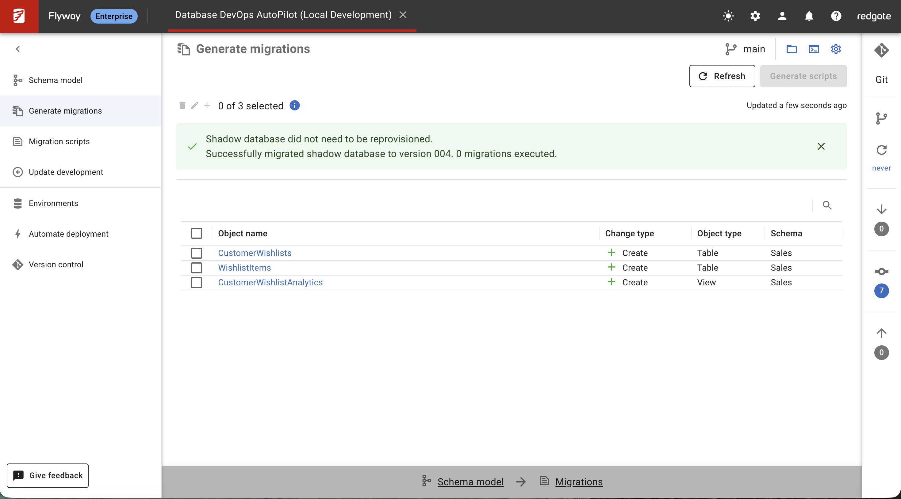

## Overview

Now that you have successfully captured your wishlist feature changes in the schema model (Lab 4), it's time to generate versioned migration scripts. These scripts will allow you to deploy the changes to other environments as part of your CI/CD pipeline. Flyway AutoPilot simplifies this process by automatically detecting changes that haven't been deployed yet, helping you stay synchronized with your database environments.

## Learning Objectives

- Understand how Flyway Desktop generates migration scripts from schema model changes
- Generate versioned migration scripts for your wishlist feature
- Review and customize migration scripts before deployment
- Verify migration script accuracy using shadow database validation
- Commit migration scripts to version control for CI/CD deployment

## Prerequisites

- Completed Lab 4 (wishlist feature captured in schema model and shadow database validated)
- Flyway Desktop connected to your development database
- Wishlist feature changes saved to schema model and committed to version control
- Understanding of shadow database concept from Lab 4
- Access to all 4 environments (Development, Shadow, UAT, Production)

## Shadow Database in Migration Generation

Building on Lab 4's introduction to shadow databases, in this lab you'll see how the **Shadow Database** is used for migration script generation:

### Migration Generation Process:

1. **AutoPilot rebuilds shadow database** with all existing migration scripts
2. **Compares development vs shadow** to detect new changes (your wishlist feature)
3. **Generates migration scripts** to bring shadow/UAT/production up to development level
4. **Validates generated scripts** against shadow database before deployment

This ensures your migration scripts will work correctly when deployed to UAT and production environments.

## Step 1: Generate Migration Scripts

### 1. Understanding the Migration Generation Process

Flyway AutoPilot compares your current **Schema Model** (which includes all the wishlist changes from Lab 4) with all existing migration scripts in your Flyway project. Currently, you have:

- **B001\_\_baseline.sql** - Your initial e-commerce platform setup
- **V002\_\_Welcome.sql** - Welcome message and initial enhancements
- **V003\_\_Add_Customer_Loyalty.sql** - Customer loyalty program
- **V004\_\_Enhanced_Product_Catalog.sql** - Product catalog improvements

By comparing the schema model against these existing scripts, Flyway can determine which changes haven't been captured as migration scripts yet - specifically your new wishlist functionality.

### 2. Access Migration Generation

1. **Open Flyway Desktop** and ensure your project is loaded
2. **Navigate to the "Generate migrations" tab** (in the left navigation)
3. **Click "Refresh"** to analyze your current changes



You should see the same changes that were detected in Lab 4, now ready for migration script generation:

```
✅ Shadow database did not need to be reprovisioned.
✅ Successfully migrated shadow database to version 004. 4 migrations executed.
```

### 3. Review Detected Changes

AutoPilot will show you the same changes from Lab 4, now ready for migration script generation:

**Expected Changes List:**

```
Object Name              | Change Type | Object Type | Schema
-------------------------|-------------|-------------|----------
InventoryAudit          | 🔧 Modify   | Table       | Operation
ProductReviews          | 🔧 Modify   | Table       | Operation
CustomerLoyalty         | 🔧 Modify   | Table       | Sales
CustomerWishlists       | ➕ Create   | Table       | Sales
WishlistItems          | ➕ Create   | Table       | Sales
CustomerWishlistAnalytics| ➕ Create   | View        | Sales
```

**What This Means:**

- **🔧 Modify Operations**: Minor schema differences in existing tables (formatting/metadata updates)
- **➕ Create Operations**: Your new wishlist functionality that needs deployment
- **Ready for Migration**: All changes have been validated by the shadow database

**Note:** These are the exact same changes you saw in Lab 4 Step 4.5, now ready to become migration scripts!

## Step 2: Select and Generate Scripts

### 1. Select Changes for Migration

1. **Review the list of detected changes** in the migration generation dialog
2. **Select the checkbox** next to each object you want to include in the migration:

**Recommended Selections:**

- ✅ **InventoryAudit** (Modify) - Include minor schema updates
- ✅ **ProductReviews** (Modify) - Include minor schema updates
- ✅ **CustomerLoyalty** (Modify) - Include minor schema updates
- ✅ **CustomerWishlists** (Create) - Your new wishlist table
- ✅ **WishlistItems** (Create) - Your wishlist items table
- ✅ **CustomerWishlistAnalytics** (Create) - Your wishlist analytics view

**Note:**

- **Create Operations**: These are your new wishlist features - definitely include these
- **Modify Operations**: These are minor updates to existing tables - safe to include for schema consistency
- Flyway allows you to select a subset if needed, but including all ensures complete synchronization

3. **Click "Generate scripts"** to proceed

### 2. Review and Customize the Generated Migration

Flyway will generate the migration script based on your selected changes. You'll see:

**Migration Script Preview:**


### 3. Review Migration Details

**Key Points to Notice:**

- **Version Number**: Flyway automatically assigns **V005** by incrementing from your latest migration (V004)
- **Timestamp**: Adds timestamp for uniqueness in collaborative environments
- **Transaction Wrapper**: Ensures all changes apply atomically or rollback completely
- **Proper Sequencing**: Tables created before views that depend on them
- **Undo Scripts**: AutoPilot generates undo scripts automatically (shown at bottom of script)

### 4. Customize Migration Name (Optional)

1. **Review the default migration name**: Usually something like `V005__Add_wishlist_functionality.sql`
2. **Customize if needed** to be more descriptive:
   ```
   V005__Add_Customer_Wishlist_Feature.sql
   ```
3. **Ensure the name follows your team's naming conventions**

**Tip:** Flyway AutoPilot also creates **Undo scripts** (`U005__Add_Customer_Wishlist_Feature.sql`) automatically to help reverse changes if needed.

### 5. Save the Migration Script

1. **Review the generated script** for accuracy
2. **Make any final adjustments** if necessary (usually not required)
3. **Click "Save"** to add the migration script to your project

The migration script is now saved in your `migrations/` folder and ready for deployment!

## Step 3: Verify and Commit Changes

### 1. Verify the Generated Migration (Recommended)

Before committing the script, it's good practice to verify its accuracy:

1. **Click "Verify Generated Migrations"** in Flyway Desktop
2. **AutoPilot runs the migration** against the Shadow Database to check for:
   - Syntax errors
   - Dependency issues
   - Constraint conflicts
   - Performance problems

**Expected Verification Result:**

```
✅ Migration V005__Add_Customer_Wishlist_Feature.sql verified successfully
✅ All dependencies resolved correctly
✅ No syntax errors detected
✅ Undo script U005__Add_Customer_Wishlist_Feature.sql validated
```

3. **If verification passes**, proceed to commit
4. **If issues are found**, review and fix before committing


### 2. Review Uncommitted Changes

1. **Switch to the Version Control tab** in Flyway Desktop
2. **Open the "Uncommitted Changes" panel**
3. **Review the files** that were generated:

**Expected Files:**

```
migrations/V005__Add_Customer_Wishlist_Feature.sql
migrations/U005__Add_Customer_Wishlist_Feature.sql (undo script)
flyway.toml (updated project metadata)
```

4. **Click on each file** to review the generated content and ensure accuracy

### 3. Commit and Push Changes

1. **Select all the migration-related changes** for commit
2. **Enter a descriptive commit message**:

   ```
   Add V005 migration script for customer wishlist feature

   - Generated migration script for wishlist tables and view
   - Added CustomerWishlists table for wish management
   - Added WishlistItems table with priority and notes
   - Added CustomerWishlistAnalytics view for insights
   - Includes undo script for rollback capability
   - Verified against shadow database successfully
   ```

3. **Click "Commit and Push"** (or "Commit" then "Push Changes")

**Congratulations!** You have successfully generated and committed your first versioned migration script using Flyway AutoPilot.

## Step 4: Understand Your Migration Pipeline

### 1. Review Your Complete Migration History

Your project now has a complete migration pipeline:

**Migration Sequence:**

- **B001\_\_baseline.sql** - Initial e-commerce platform setup
- **V002\_\_Welcome.sql** - Welcome enhancements
- **V003\_\_Add_Customer_Loyalty.sql** - Customer loyalty program
- **V004\_\_Enhanced_Product_Catalog.sql** - Product catalog improvements
- **V005\_\_Add_Customer_Wishlist_Feature.sql** - Customer wishlist functionality (**NEW!**)

### 2. Deployment Readiness

Your migration script is now ready for deployment to:

**Target Environments:**

- ✅ **Shadow Database** (`db-autopilot-shadow-001`) - For migration validation and testing
- ✅ **UAT Database** (`db-autopilot-uat-001`) - For user acceptance testing
- ✅ **Production Database** (`db-autopilot-prod-001`) - For live deployment
- ✅ **CI/CD Pipelines** - For automated deployment processes across all environments

### 3. What Happens During Deployment

When you deploy V005 to other environments, Flyway will:

1. **Check current database version** (should be V004 in UAT)
2. **Apply V005 migration** to create wishlist functionality
3. **Update schema history table** to record V005 as applied
4. **Validate deployment success** against expected schema state

## Verification Checklist ✅

Confirm you have successfully completed Lab 5:

### Migration Generation Verification

- [ ] Successfully accessed migration generation in Flyway Desktop
- [ ] Reviewed detected changes from schema model vs existing migrations
- [ ] Selected all wishlist-related changes for migration script
- [ ] Generated V005 migration script with proper version numbering
- [ ] Reviewed generated script content for accuracy and completeness

### Script Quality Verification

- [ ] Migration script includes all wishlist tables and views
- [ ] Script has proper SQL Server transaction handling
- [ ] Dependencies are correctly sequenced (tables before views)
- [ ] Undo script (U005) was generated automatically
- [ ] Migration script passed shadow database verification

### Version Control Verification

- [ ] Migration files saved in `migrations/` folder correctly
- [ ] V005 and U005 scripts committed to version control
- [ ] Commit message describes the migration purpose clearly
- [ ] Project metadata (flyway.toml) updated appropriately
- [ ] All changes pushed to Git repository successfully

## Key Concepts Learned

### Migration Script Generation

- **Automated Comparison**: AutoPilot compares schema model vs existing migration scripts
- **Version Management**: Automatic version numbering with timestamp uniqueness
- **Change Detection**: Identifies only new changes that need deployment scripts
- **Script Quality**: Generates production-ready SQL with proper transaction handling

### Deployment Readiness

- **Environment Independence**: Scripts work across development, UAT, and production
- **Rollback Capability**: Undo scripts provide safety net for production deployments
- **CI/CD Integration**: Migration scripts integrate seamlessly with automated pipelines
- **Team Collaboration**: Version control enables multiple developers to work safely

### Best Practices Applied

- **Verification First**: Always validate scripts before deployment
- **Descriptive Naming**: Clear migration names improve maintenance
- **Complete Commit Messages**: Detailed history helps future troubleshooting
- **Incremental Changes**: Focused migrations reduce deployment risk

## What's Next?

You now understand how to generate production-ready migration scripts from schema model changes.

**In Lab 6**, you'll learn how to:

- **Deploy migration scripts** to your UAT and Production environments using Flyway CLI
- **Configure automated CI/CD pipelines** with GitHub Actions for safe production deployments
- **Set up database deployment workflows** with UAT validation before production releases

**You are becoming proficient in database DevOps with Flyway AutoPilot.**

## Additional Resources

- [Flyway Migration Scripts Documentation](https://documentation.red-gate.com/flyway/flyway-concepts/migrations)
- [AutoPilot Migration Generation Guide](https://documentation.red-gate.com/flyway/database-development-using-flyway/generating-migrations-with-flyway-desktop)
- [Migration Script Best Practices](https://www.red-gate.com/simple-talk/databases/database-administration/flyway-best-practices/)
- [Version Control for Database Teams](https://documentation.red-gate.com/flyway/database-development-using-flyway/version-control-for-database-teams)

---

## 🔗 Navigation

**⬅️ [Previous: Lab 4 - Schema Change Capture](/database-devops-autopilot/training/flyway-autopilot/labs/lab4-schema-change-capture)** | **🏠 [Workshop Overview](/database-devops-autopilot/training/flyway-autopilot/labs/)** | **➡️ [Next: Lab 6 - CI/CD Deployment](/database-devops-autopilot/training/flyway-autopilot/labs/lab6-cicd-deployment)**

---
